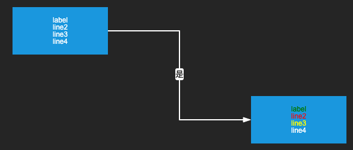

# 流程圖工具使用教學

先附上使用的X6套件的官方 [Document](https://x6.antv.vision/zh/docs/tutorial/about)
以及另外有用到的套件 [判斷字串語系](https://openbase.com/js/franc)、[G2用於繪製圓餅圖](https://g2.antv.vision/zh/docs/manual/about-g2)

## 使用混淆化的程式碼

使用上必須是經過混淆化的程式碼，並且每次程式碼有更新(後續會加上版號)也需要再混淆化一次再使用，npm install 過後，執行

```javascript
    npm run rollup
```

---------------------------------------------------------
## 導入H5FC

混淆化後會在 dist/ 拿到一個 **rollupBundle.umd.js** 檔案，在 index.html 中直接導入即可

```javascript
    <script src="./rollupBundle.umd.js"></script>
```

然後直接 new 它即可，例如:

```javascript
    /**
     * @param canvasId (string) 用於套入canvas的<div>的id
     * @param option (obj)(optional) 可調整參數
     * {
     *      @param width (number) 畫布寬，默認容器寬
     *      @param height (number) 畫布高，默認容器高
     *      @param theme (string) 主題，默認 'dark'暗色主題，可以代入 'light'改為亮色主題
     *      @param isGrid (boolean) 是否需要格線，預設開啟
     * }
     */
    let fc = new H5FC.FlowChart('container', { width: 1200, height: 800, theme: 'dark', isGrid: false });
```
---------------------------------------------------------
## 畫流程圖相關功能
### 建立節點

**drawNode()** 可以建立一個節點並回傳該節點  
* _shape_ 決定了節點的外觀，目前有建立幾個樣式在 H5FC.registerName 中，之後考慮開放自定義節點接口
* _attr_ 為節點文本、port文本相關參數
* _data_ 為自定義內容參數，未來擴充節點資料也盡量存在這裡面
* 雖然節點會自動根據attr給入的文本長度改變大小，但還是建議自己加入'\n'來換行，避免單個節點過寬的情況
* colorSets 格式 { index: fill } 中的index是對應文本行數，從0開始

```javascript
    /**
     * 
     * @param posX 座標x
     * @param posY 座標y
     * @param shape 形狀, 預設圓角矩形, 對應 H5FC.registerName 內容
     * 
     * @param attr (obj, optional) 文本相關參數(不包含tip)
     * {
     *      @param label (string)(optional) 文字, 需注意換行要加"\n"
     *      @param fill (string)(optional) 節點整段文字顏色，會被 data.colorSets 蓋掉 ex.'red', '#FF0000'
     *      @param fontSize (number)(optional) 文字大小，最小12，預設也是12
     *      @param portLabels (array<object>)(optional) 周圍port的文字
     *      [
     *          {
     *              @param portId (string) 要顯示在哪個port，有12個，ex.'left'左中, 'left_top'左上, 'right_bottom'右下，依此類推
     *              @param label (string) port上文字
     *              @param fill (string)(optional) port文字顏色 ex.'red', '#FF0000'
     *          }
     *      ]
     * },  
     * 
     * @param data (obj, optional) X6 相關參數之外的自定義參數
     * {
     *      @param seat (string)(optional) 如果是用 config 方式來繪製流程圖，則用來與 config 座標對應，平常就不用帶
     *      @param name (string)(optional) 節點名稱
     *      @param size (obj)(optional) 如果要調整該節點大小，傳入 { w: xx, h: xx } 的格式 
     *      @param changeToFlowChart (string)(optional) 此節點會轉換去哪個流程圖，需注意節點 shape 類型要為 H5FC.registerName.changeToOtherFlowChart
     *      @param tipContent (string) 滑鼠hover時的tip要顯示的文字
     *      @param colorSets (obj)(optional) 節點的文本分行顏色設定，格式為 { index: fill }，要注意這邊的設定會蓋掉 attr.fill 的設定
     *      @param tipColorSets (obj)(optional) 節點tip的文本分行顏色設定，格式為 { index: fill }
     * }
     */
    drawNode(posX: number = 0, posY: number = 0, shape: string = H5FC.registerName.process, attr: any = {}, data: any = {})
    
```
```javascript
    // 範例
    let node = fc.drawNode(x, y, H5FC.registerName.process,
        {
            label: 'test\nlabel\nline2',
            fill: 'blue',
            portLabels: [
                { portId: 'top_left', label: '2022/03/18 15:03:55 GMT' },
                { portId: 'bottom_right', label: 'not yet', fill: 'red' },
            ]
        },
        {
            tipContent: 'tip label\nline2',
            colorSets: { 0: 'red', 1: 'red' },
            tipColorSets: { 0: 'green', 1: 'green' }
        }
    );
```

上面範例呈現的效果如下圖(黑色的節點是滑鼠hover時出現的tip)  


### 建立邊

**drawEdge()** 可以建立邊並回傳該邊
* _source_ 跟 _target_ 為起點跟終點，可以傳入三種格式
  * **{ x, y }** 基本的座標物件
  * **Node節點物件** drawNode()回傳的那個
  * **{ cell, port }** 有帶入指定的port的物件
* _shape_ 決定了邊的樣式，目前有建立幾種樣式在 H5FC.registerName 中
    * 直線 normalEdge
    * 轉一次彎型 lEdge
    * 轉兩次彎型 cRightEdge、cLeftEdge、cTopEdge、cBottomEdge
* _data_ 如果邊上想要有文字就帶入 label 中

```javascript
    /**
     * 
     * @param source 從哪個座標 { x, y } 或節點 { cell } 或指定節點的連接點 { cell, port }
     * @param target 到哪個座標 { x, y } 或節點 { cell } 或指定節點的連接點 { cell, port }
     * @param direction 方向，水平H 或 垂直V 或 L型(需要給 port 參數)
     * @param shape (string)(optional) 哪種類型的邊，預設白色直線單箭頭
     * 
     * @param data (obj)(optional) 自定義參數
     * {
     *      @param label (string)(optional) 邊上顯示文字，通常是“是”、“否”
     *      @param sourceSeat (string)(optional) 起點座標，如果是用 config 方式來繪製流程圖，則用來與 config 座標對應，平常就不用帶
     *      @param targetSeat (string)(optional) 終點座標，如果是用 config 方式來繪製流程圖，則用來與 config 座標對應，平常就不用帶
     * }
     */
    drawEdge(source: any = { x: 0, y: 0 }, target: any = { x: 0, y: 0 }, direction: string = 'v', shape: string = H5FC.registerName.normalEdge, data: any = {})
```
```javascript
    // 範例
    let node1 = nodeArray[i];
    let node2 = nodeArray[i + 1];

    let edge = fc.drawEdge(node1, node2, 'h', H5FC.registerName.normalEdge, { label: 'Y' });
```

上面範例呈現的效果如下圖  


```javascript
    // 範例
    let node1 = { cell: nodeArray[i], port: 'right_top' };
    let node2 = { cell: nodeArray[i + 1], port: 'left_bottom' };

    let edge = fc.drawEdge(node1, node2, 'h', registerName.normalEdge, { label: 'Y' });
```

上面範例呈現的效果如下圖  


```javascript
    // 範例
    let node1 = { cell: nodeArray[i], port: 'right' };
    let node2 = { cell: nodeArray[i + 1], port: 'right' };

    let edge = x6fc.drawEdge( node1, node2, 'c', registerName.cRightEdge, { label: 'Y' });
```

上面範例呈現的效果如下圖  


```javascript
    // 範例
    let node1 = { cell: nodeArray[i], port: 'right' };
    let node2 = { cell: nodeArray[i + 1], port: 'left' };

    let edge = x6fc.drawEdge( node1, node2, 'z', registerName.zEdge, { label: 'Y' });
```

上面範例呈現的效果如下圖  



### 改變節點的文字

**setNodeLabel()** 可以在建立節點後改變該節點的文字

```javascript
    /**
     * @param cell 節點
     * @param label 該節點本身的文字
     */
    setNodeLabel(cell: any = Node, label: string = '')
```
```javascript
    // 範例
    fc.setNodeLabel(node, 'Changed label');
```

上面範例呈現的效果如下圖 (會從左變為右) 


### 改變節點port文字

**setPortsLabel()** 可以在建立節點後改變該節點 port 的文字

```javascript
    /**
     * @param cell 節點
     * @param portLabels (Array) 要設定文字的ports陣列
     * [
     *      {
     *          @param portId (string) 要顯示在哪個port，有12個，ex.'left'左中, 'left_top'左上, 'right_bottom'右下，依此類推
     *          @param label (string) port上文字
     *          @param fill (string)(optional) port文字顏色 ex.'red', '#FF0000'
     *      }
     * ]
     */
    setPortsLabel(cell: any = Node, portLabels: Array<any> = [])
```
```javascript
    // 範例
    fc.setPortsLabel(node, [
        { portId: 'top_left', label: '2022/03/18 15:03:55 GMT' },
        { portId: 'bottom_right', label: 'not yet', fill: 'red' },
    ]);
```

上面範例呈現的效果如下圖 (會從左變為右) 


### 改變節點內各行文字顏色

**setNodeLabelColor()** 可以在建立節點後改變該節點文字各行的顏色

* 如果在 drawNode() 時有給 _colorSets_ 參數，就不用另外呼叫這個函式

```javascript
    /**
     * @param cell 節點
     * @param settings (array)
     * [
     *      {
     *          @param index (number) 對應文本行數注意從0開始,
     *          @param fill (string) 欲改變之顏色 ex.'red', '#FF0000'
     *      }
     * ]
     */
    setNodeLabelColor(cell: any = Node, settings: Array<any> = [])
```
```javascript
    // 範例
    fc.setNodeLabelColor(node, [
        { index: 0, fill: 'green' },
        { index: 1, fill: 'red' },
        { index: 2, fill: 'yellow' },
    ]);
```

上面範例呈現的效果如下圖 (會從左變為右) 


---------------------------------------------------------
## 其他功能
### 清除畫布
**clearGraph()** 可以在 _建立畫布_ 後呼叫，清空畫布所有物件

### 放大/縮小畫布
**zoomIn()** / **zoomOut()** 可以在 _建立畫布_ 後呼叫，放大/縮小畫布

### 隱藏/顯示隔線
**hideGrid()** / **showGrid()** 可以在 _建立畫布_ 後呼叫，隱藏/顯示隔線

### 設定上一頁按鈕visible
**setBackBtnVisible(visible)** 左上有一個返回上一頁按鈕，帶入 true/false 來 顯示/隱藏

### 設定上一頁按鈕callback
**setBackBtnCallback(callback)** 左上有一個返回上一頁按鈕，預設點擊無效果，帶入自定義 callback 函式

-----------------------------------------------------------------
## TODO以及未來規劃
### [未完成]
* 動畫相關功能
    * 主要 function 在 **startNodeAnimate()** ，功能為從給定的節點開始按路徑逐個節點、邊高亮
    * 但目前sendToken() 物件有顯示問題，預估跟套件底層寫法有關，不易排查，故先擱置
    * 日後也考慮換個做法，不一定用X6給的方法

* config 導入導出 JSON 功能
    * 主要 function 在 **drawFromConfig()** ，功能為依照給入的特定格式撰寫的 config 檔建立畫面
    * 之前有完成一版，包含導入導出功能，但由於後來使用習慣偏向直接以 drawNode() 直接繪製，加上後續對於資料格式也有調整，故此功能也暫時擱置，之後有機會再同步新的資料格式

### [優化]
* 目前已知需要優化的點為，初次繪製大量節點時，會繪製太久

### [未來規劃]
* 本工具之後會與自動化測試整合，詳細的資料連動、存儲方式還需研究
* 之前有導入 G2 這個套件，主要用於繪製圓餅圖，如果後續有需要加入至流程圖，連動做法也需要再研究
* X6 本身就有服務流程圖編輯器的相關做法，所以如果之後有要做相關開發也能直接支援
